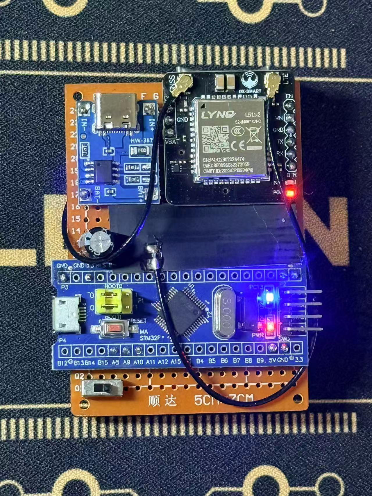
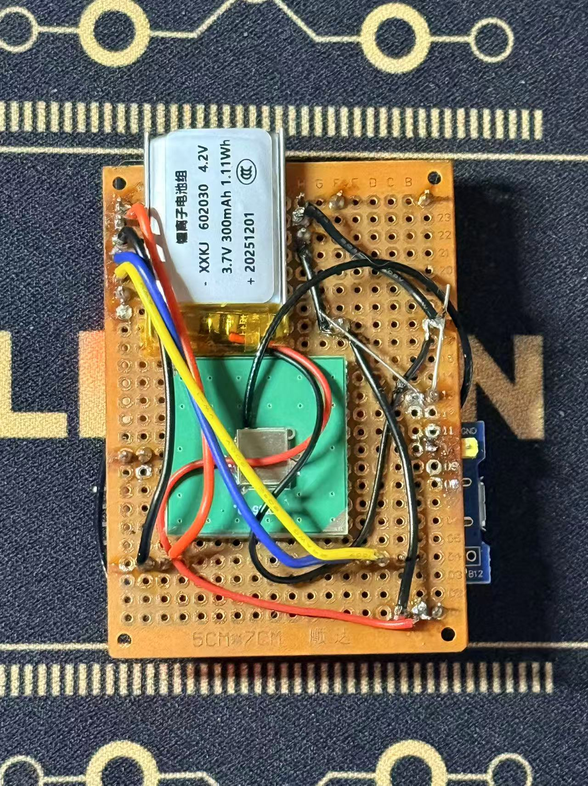

# stm32-4g-gps

Rust `no_std` firmware for **STM32F030C8** + 4G cellular modem with integrated GPS.  
Framework: [Embassy](https://embassy.dev/) — async executor, blocking UART, embassy-time.

## Hardware

| Signal | Pin |
|--------|-----|
| USART1 TX → modem RX | PA9 |
| USART1 RX ← modem TX | PA10 |
| LED (active-low) | PC13 |
| GPS power GPIO | PA12 (via AT+CGDRT/CGSETV) |

## Hardware Photos

| Front | Rear |
|---|---|
|  |  |

## Hardware Modules

### Lynq L511-2 (4G + GNSS)

- Module: **Lynq L511-2** — a compact cellular module used on this prototype. It provides 4G/LTE cellular connectivity and an integrated GNSS receiver (GPS). The module exposes UART pins for AT command control (`TX`, `RX`), power input pins (`VIN`, `VBAT`, `GND`), and LED/status indicators.
- Typical connections on this board:
  - UART TX/RX connected to the MCU UART pins (`PA9` TX → module RX, `PA10` RX ← module TX).
  - Module power (VBAT/VIN) is supplied from the battery/power management section.
  - External antenna connector or pad is present and should be used for reliable GNSS and cellular reception.
- In software the module is controlled via AT commands over UART for modem setup, HTTP requests, and GPS control (`AT+MGPSC`, `AT+GPSST`, `AT+ICCID`, etc.). Ensure the module has a stable 3.7–4.2V supply and a proper antenna connection for best results.

### TP4056 (Li‑ion Charger / Power Management)

- Module: **TP4056** — a single‑cell Li‑ion charge management IC commonly provided as a small micro-USB board. It implements a linear constant‑current / constant‑voltage charging profile for one 3.7V Li‑ion cell and typically exposes the following pins: `BAT+`, `BAT-`, `IN+` (micro‑USB 5V), `GND`, and `STAT` LEDs.
- Typical usage on this prototype:
  - The on-board TP4056 charges the single‑cell Li‑ion battery (3.7V nominal, 4.2V full) from a micro‑USB input.
  - The battery positive/negative (`BAT+`/`BAT-`) is routed to the system power input to feed the Lynq module and the STM32 board through the power distribution wiring.
  - Charging status pins (`STAT`) indicate charging/charge‑complete via LEDs on the TP4056 board.
- Safety notes:
  - The TP4056 is a linear charger — it dissipates heat when charging at higher currents. Ensure adequate ventilation and avoid charging at the maximum rate without heat sinking.
  - Do not bypass the battery protections: use a proper battery with built‑in protection or a protection circuit where required.

### Wiring Notes

- UART: Ensure `PA9` (MCU TX) → module RX and `PA10` (MCU RX) ← module TX. Signal levels should be compatible (this prototype uses 3.3V logic).
- Power: The module and MCU are powered from the Li‑ion battery through the TP4056/ power rail. Confirm VBAT is within the module specification before connecting.
- GPS power control: The firmware toggles GPS power via a GPIO (configured as `PA12` in this project). The hardware must include a power switching MOSFET or transistor controlled by that GPIO to reliably power-cycle the GNSS portion of the module.

If you want, I can add the actual image files into the repository at `docs/images/hw_front.jpg` and `docs/images/hw_back.jpg` and commit them to the current branch. Tell me which branch to use for that commit (current branch is fine if you want it saved here).


## Firmware overview

### Startup sequence
1. Modem init: `AT` → `ATE0` → `CFUN=1` → `CGATT=1` → `QICSGP` → `NETOPEN`
2. GPS one-time init (`src/gps.rs :: init`):
   - Configure GPIO power pin
   - Clear AGPS data (`AT+MGPSGET=ALL,0`)
   - Power on GPS chip (`AT+MGPSC=1`), wait for `start up success.`
   - Set GPS mode (`AT+GPSMODE=1`)
   - Download & inject AGPS (`AT+AGNSSGET` / `AT+AGNSSSET`)
   - Warm-up GPSST query, then power off

### Main loop (every ~90 s)
- Collect system info (ATI / CSQ / CCLK via `src/system_info.rs`)
- **GPS power-save state machine**:
  - Phase 1 — *Acquisition*: GPS stays on; poll `AT+GPSST` each cycle
  - Phase 2 — *Stable* (3 consecutive fixes): enter duty-cycle mode
  - Phase 3 — *Duty-cycle*: GPS off for 2 cycles, on for 1; revert to Phase 1 after 5 consecutive no-fix
- GPSST result: raw `+GPSST: …` line forwarded as-is; off-cycle POSTs reuse the cached line with ` CACHED=1` appended
- ICCID queried while GPS is off (avoids NMEA interleaving), cached between queries
- HTTP POST: `AT$HTTPOPEN` → `AT$HTTPPARA` → `AT$HTTPRQH` → `AT$HTTPACTION` → `AT$HTTPDATA` → `AT$HTTPSEND` → `AT$HTTPCLOSE`

### Payload fields (plain text, `\r\n` separated)
```
ATI=...
CSQ=...
CCLK=...
+GPSST: <fix>,<lon>,<lat>,...   (or with CACHED=1 suffix)
ICCID=...
GPS_PS=0|1
```

## Build & flash

```sh
cargo check --target thumbv6m-none-eabi
cargo flash --release --chip STM32F030C8 --probe 0483:3748
```

Target: `thumbv6m-none-eabi` (Cortex-M0, no FPU).
